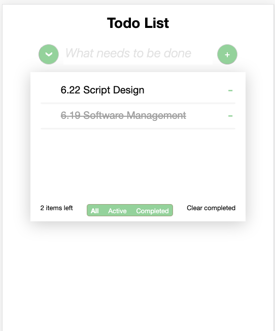

# TodoMVC

The final project for Web Programming course

## 1. Introduction

This is a TodoMVC demo for mobile device, based on original html & css & javascript.

## 2. Basic function

- CRUD for the todo list
- Save the todo list by localstorage, the data can be reload after refresh

## 3. Advanced function

- Filter the todo item by different status (All, Active, Completed)
- Edit each todo item directly
- The batch operation
  - Change item status
  - Delete all completed items

## 4. Additional

Use Hammer.js[^1] to add more mobile gesture 

- Pree long time on single item to edit
- Swipe on single item to change its status

## 5. Reference

- [TodoMVC](https://github.com/luics/web-dev/tree/master/examples/TodoMVC) by [@luics](https://github.com/luics)
- [Jquery 1.12.4](https://jquery.com/)

- [^1]:  [Hammer.js 2.0.7](http://hammerjs.github.io/)